# 这是小程序 Crooner 的代码
___

## 环境搭建
1. 在此之前我们可以学习一下[使用mpvue开发小程序教程](https://www.jianshu.com/p/6f8d74be3ff8)（注意：在步骤 <font color='red'>创建第一个基于mpvue的小程序项目代码</font>）中，需要配置小程序的appid，暂时可以跳过此阶段。
2. 安装node工具，点击链接，[下载地址](https://nodejs.org/en/download/)
   下载版本不能搞错，根据自己的电脑是多少位来选择对应的下载版本，下载后即可安装。
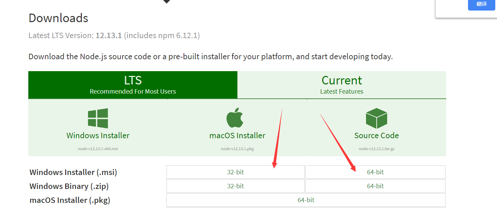
3. 直接在电脑终端执行这两个步骤（可检测是否安装成功）
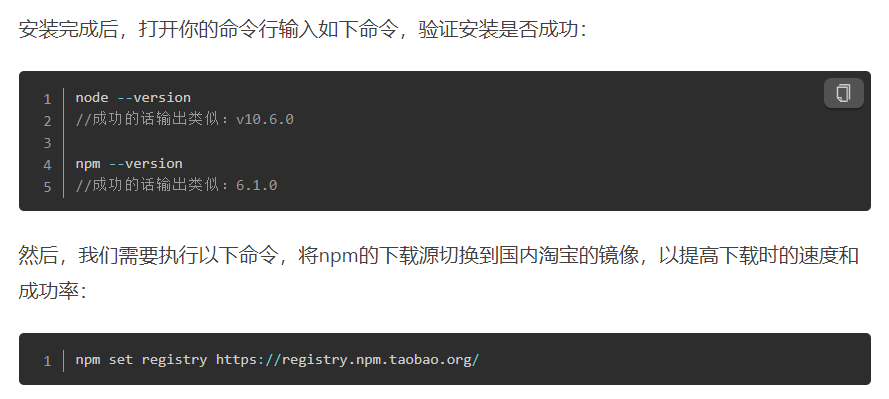
4. 接下来在终端继续执行npm install vue-cli –g，输入vue验证
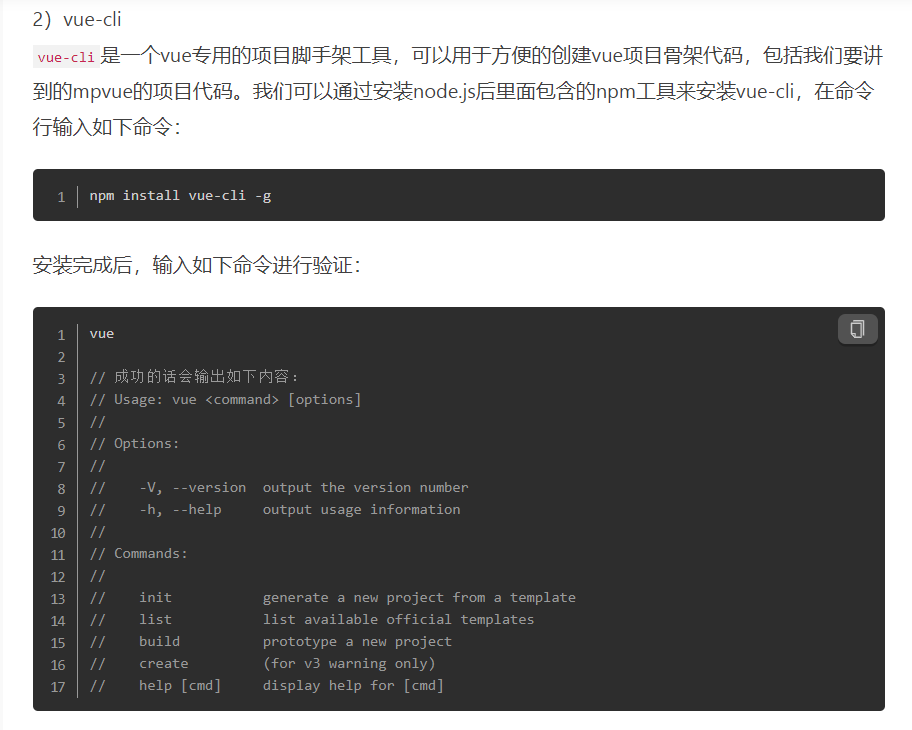
5. 下载本项目，放到自己能找的到的位置
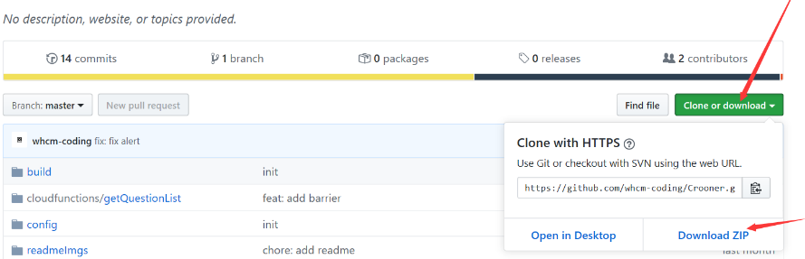
6. 在项目所在地进入终端，输入npm install。这个步骤相当于pipenv install。
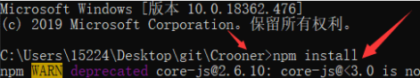
   安装成功如下
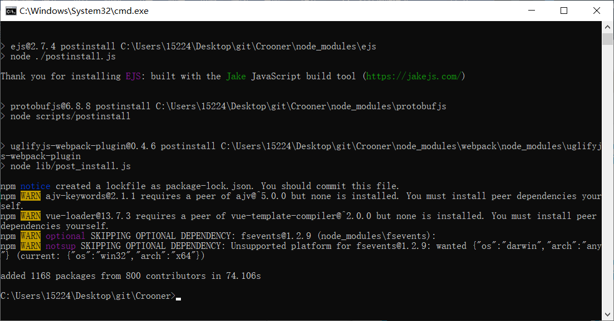
7. 安装微信开发者工具，也要根据自己电脑位数来安装
[下载地址](https://developers.weixin.qq.com/miniprogram/dev/devtools/download.html)
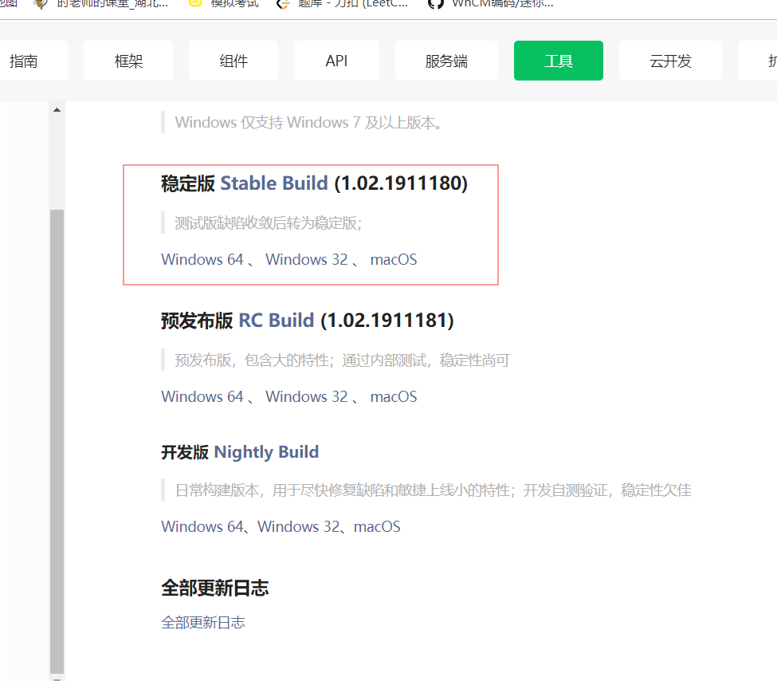
8. 打开微信开发者工具，选择：项目->导入项目，导入此项目，需要配置小程序的appid，可以向项目贡献者询问。
   记得在微信开发者工具的菜单》设置 》编辑设置 中，将“保存时自动编译小程序”勾选上。最后点击导入。
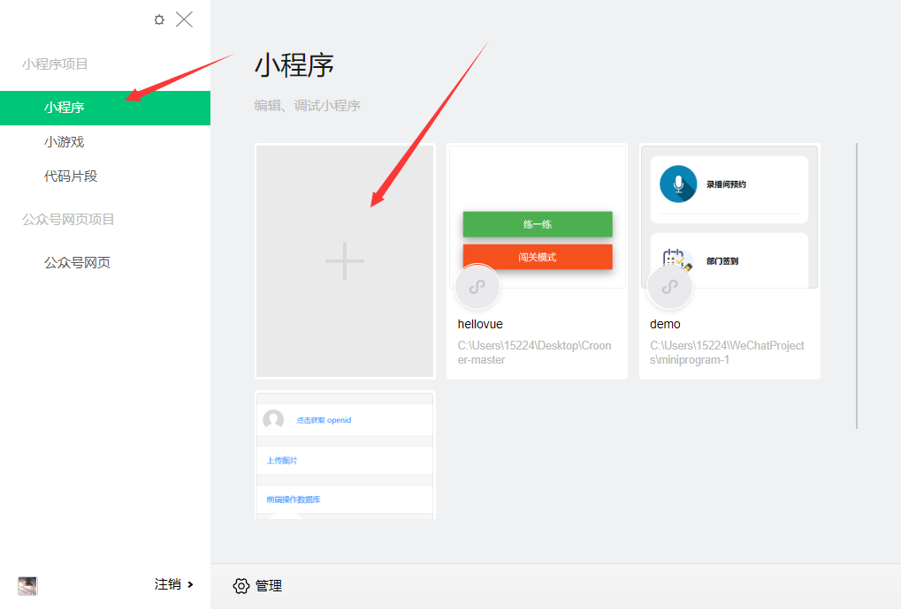
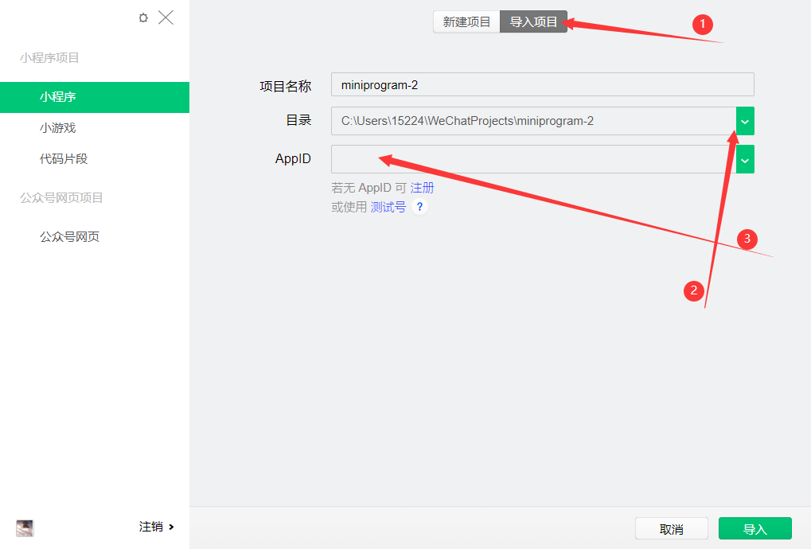
9. 到这一步就快要成功了，不过你的微信小程序中红色方框里面会报错，应该是找不到app.json文件。
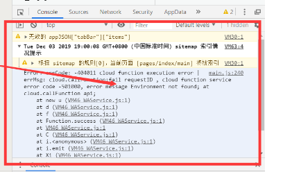
10. 这时候打开我们的项目，找到src文件夹，点进去通过cmd到终端，输入npm  start。
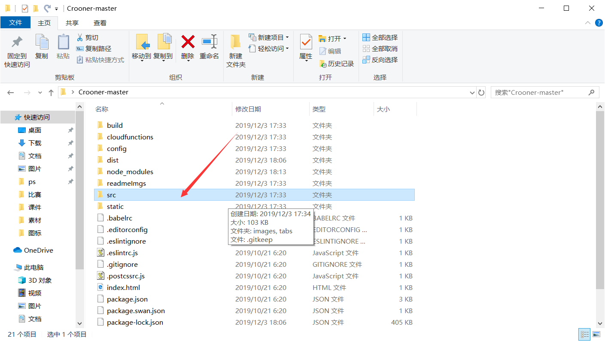
显示如下即可。再去小程序那里错误应该消失了。
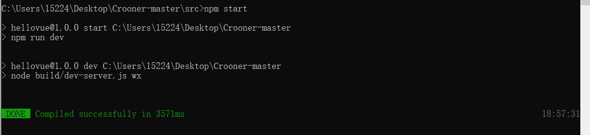
11. 在微信开发者工具中，点“编译”按钮，即可看小程序界面
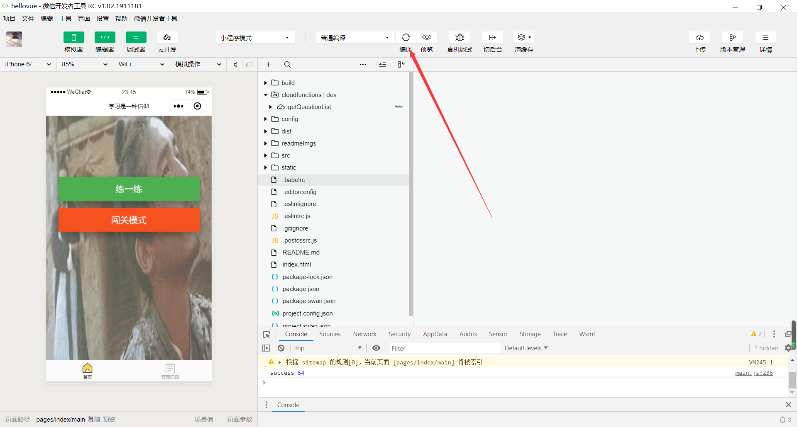
___

## 项目代码说明
1. 主页代码在pages/index 中，该模块是小程序的主页
2. “练一练”相关页面的代码在pages/normal 中
3. “闯关模式”相关页面的代码在pages/barrier 中
___

## 开发前必看
1. 熟练 [vuejs](https://cn.vuejs.org/v2/guide/)
2. [mapvue](http://mpvue.com/mpvue/) 这里提到了mpvue不支持的vue中的部分功能。但凡遇到按照vuejs的写法应当可行的代码，在小程序中不可行时，一定要检查此文档
___

## 开发步骤
本项目按照进行，提供两种方法：
1. 难一点的规范化版本：[git的分支协作开发](https://segmentfault.com/a/1190000011010729)：
    1. clone 本项目，此时会有一个 master 分支
    2. ```git checkout -b your_brach_name```
    3. 愉快地在你的分支上进行开发工作
    4. 开发完成后, ```git push origin your_brach_name```
    5. 在github上选择new pull request(如下图)
  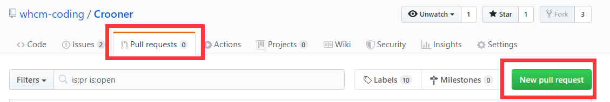
  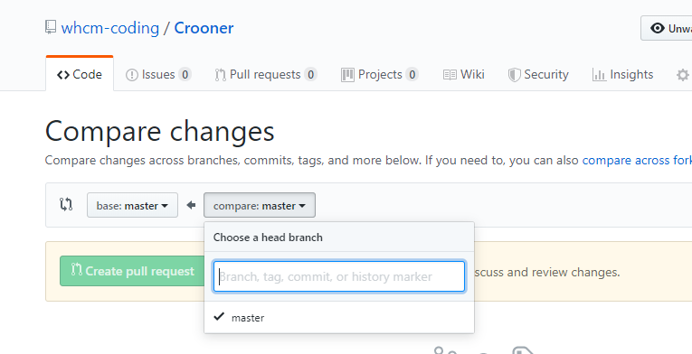
       base 永远是master,compare选择你的分支即可
    6. 每次开发之前:

    ```
      git checkout master
      git pull origin master
      git branch -D your_branch_name（如果每次取相同的名字就需要删掉。实际上不要每次都取一样的名字，比如dev之类的）
    ```
    
    7. 从 1.2 开始重复

***
2. 简单版本(不采用，这种方法无法维护项目，管理成本太大)：
    1. clone 本项目
    2. 愉快地进行开发工作
    3. 提交代码之前```git pull origin master```
    4. 痛苦的修复冲突，参考[git的分支协作开发](https://segmentfault.com/a/1190000011010729)文档中的“分支冲突解决”部分
    5. 修复冲突后```git add .``` ```git commit -m"your message"```
    5. 提交代码```git push origin master```
***

## 注释说明
1. 由于各种(懒)原因，代码中有一些hack或者todo标注的代码块，这种代码不建议参考，有兴趣(时间)可以修改一下
___
## 相关公众号推荐
crooning


