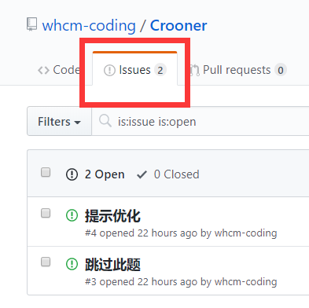
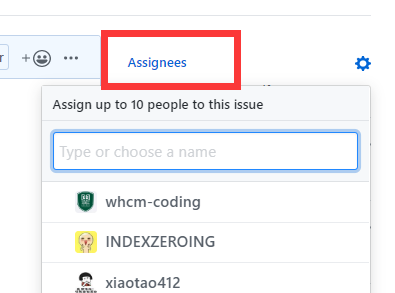

# 这是小程序 Crooner 的代码
___

## 环境搭建
1. 在此之前我们须阅读[使用mpvue开发小程序教程](https://www.jianshu.com/p/6f8d74be3ff8)（注意：在步骤 <font color='red'>创建第一个基于mpvue的小程序项目代码</font>）中，需要配置小程序的appid(所谓appid，是小程序的唯一标识，每个小程序都有自己的唯一appid)，可以使用自己的appid来创建第一个小程序。
2. 参考上述教程安装 [nodejs](https://nodejs.org/en/download/)、[git](https://git-scm.com/downloads)、[微信开发者工具](https://developers.weixin.qq.com/miniprogram/dev/devtools/download.html)（tips: 下载版本不能搞错，根据自己的电脑是多少位来选择对应的下载版本）
3. 执行这两个步骤（检测是否安装成功）
```
node --version
npm --version
```
4. 下载本项目，放到自己能找的到的位置
```
git clone https://github.com/whcm-coding/Crooner.git
```
5. 在项目所在地进入终端，输入
```
npm install
```
6. 打开微信开发者工具，选择：项目->导入项目，导入此项目，需要配置小程序的appid，<font color='red'>应向项目贡献者询问</font>。记得在微信开发者工具的菜单》设置 》编辑设置 中，将“保存时自动编译小程序”勾选上。最后点击导入。
7. 到这一步就快要成功了，不过你的微信小程序中红色方框里面会报错，应该是找不到app.json文件。

8. 这时候打开我们的项目，找到src文件夹，点进去通过cmd到终端，输入下述命令再去小程序那里错误应该消失了。
```
  npm  start
```
9. 在微信开发者工具中，点“编译”按钮，即可看小程序界面

___

## 项目代码说明
1. 主页代码在pages/index 中，该模块是小程序的主页
2. “练一练”相关页面的代码在pages/normal 中
3. “闯关模式”相关页面的代码在pages/barrier 中
___

## 开发前必看
1. 熟练 [vuejs](https://cn.vuejs.org/v2/guide/)
2. [mapvue](http://mpvue.com/mpvue/) 这里提到了mpvue不支持的vue中的部分功能。但凡遇到按照vuejs的写法应当可行的代码，在小程序中不可行时，一定要检查此文档
___

## 开发步骤
本项目按照进行，提供两种方法：
1. 难一点的规范化版本：[git的分支协作开发](https://segmentfault.com/a/1190000011010729)：
    1. clone 本项目，此时会有一个 master 分支
    2. ```git checkout -b your_brach_name```
    3. 愉快地在你的分支上进行开发工作
    4. 开发完成后, ```git push origin your_brach_name```
    5. 在github上选择new pull request(如下图)
  
  
       base 永远是master,compare选择你的分支即可
    6. 每次开发之前:

    ```
      git checkout master
      git pull origin master
      git branch -D your_branch_name（如果每次取相同的名字就需要删掉。实际上不要每次都取一样的名字，比如dev之类的）
    ```
    
    7. 从 1.2 开始重复

***
2. 简单版本(不采用，这种方法无法维护项目，管理成本太大)：
    1. clone 本项目
    2. 愉快地进行开发工作
    3. 提交代码之前```git pull origin master```
    4. 痛苦的修复冲突，参考[git的分支协作开发](https://segmentfault.com/a/1190000011010729)文档中的“分支冲突解决”部分
    5. 修复冲突后```git add .``` ```git commit -m"your message"```
    5. 提交代码```git push origin master```
***

## 需求管理
本项目采用github的issue来管理需求。有任何需求可新建一个issue，详细说明要求和设计。

感兴趣的同学可认领issue进行开发，避免彼此冲突。

___

## 第三方库
### 引入了 [vant-weapp](https://youzan.github.io/vant-weapp/#/quickstart#yin-ru-zu-jian) 作为样式库。实际使用体验并不好。
-  首先，微信开发者工具构建的 miniprogram-npm 不能满足需求，必须下载最新的 vant 到 dist 对应的目录中（开发同学不必担忧，这部分代码已经修改 webpack 配置自动完成）。
- 其次，目前 vant 不能按需加载，导致初次启动微信开发者工具编译速度变慢。 
- 最后，不建议使用 vant，后续有可能去掉这个库。总的来说，mpvue 使用第三方库体验很差。
___
## 注释说明
1. 由于各种(懒)原因，代码中有一些hack或者todo标注的代码块，这种代码不建议参考，有兴趣(时间)可以修改一下
___
## 相关公众号推荐
crooning


